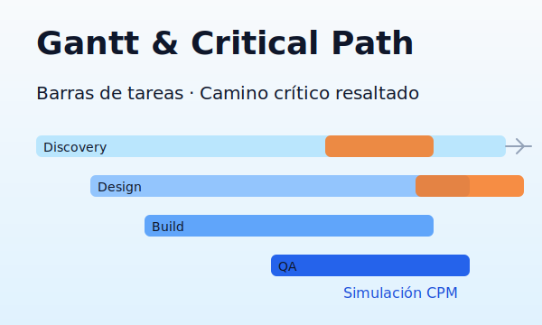
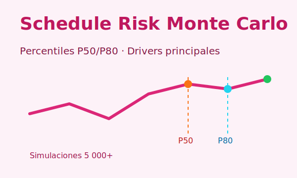
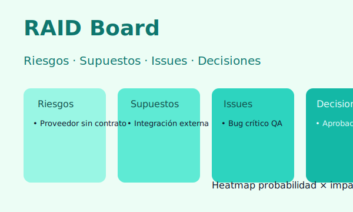
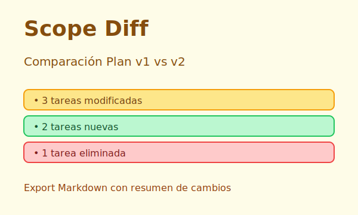
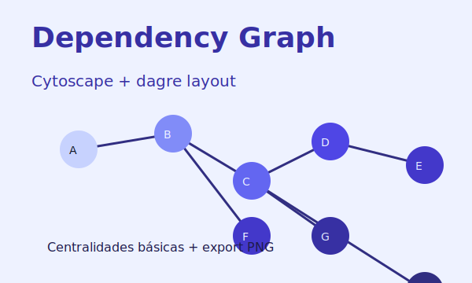

# PM Lab

PM Lab es una súper-app para Project Managers/PMO construida como una SPA 100% cliente con React + Vite. Integra herramientas esenciales para planificación, riesgos y visualización sin necesidad de backend. El proyecto está preparado para desplegarse automáticamente en GitHub Pages.

## Módulos disponibles

1. **Gantt & Critical Path** — edición de tareas, cálculo CPM y exportaciones CSV/PNG/ICS.
2. **Schedule Risk Monte Carlo** — simulaciones PERT/triangular con percentiles y drivers.
3. **RAID Board** — gestión offline de riesgos con heatmap y exportación CSV/Markdown.
4. **Scope Diff** — comparación entre versiones del plan con reporte Markdown.
5. **Dependency Graph** — render con Cytoscape + dagre y análisis de centralidad.

> La arquitectura de plugins permite añadir más herramientas fácilmente bajo `src/modules/`.

## Política de privacidad

**Todos los datos permanecen en tu navegador.** El almacenamiento se realiza con IndexedDB (Dexie) y puedes limpiarlo desde el botón “Borrar datos”. No se envía información a servidores externos.

## Esquemas CSV

### Tareas (`tasks.csv`)

| Campo        | Tipo    | Descripción                              |
|--------------|---------|------------------------------------------|
| `id`         | string  | Identificador único de la tarea          |
| `name`       | string  | Nombre                                   |
| `duration`   | number  | Duración en días (opcional)             |
| `dependsOn`  | string  | IDs separados por `;`                    |
| `assignee`   | string  | Responsable (opcional)                   |
| `status`     | string  | Estado (opcional)                        |
| `start`      | string  | Fecha inicio ISO (opcional)              |
| `due`        | string  | Fecha fin ISO (opcional)                 |
| `distribution` | string | Distribución PERT/triangular (opcional) |

### Riesgos (`raid.csv`)

| Campo   | Tipo   | Descripción                  |
|---------|--------|------------------------------|
| `title` | string | Título del riesgo            |
| `prob`  | number | Probabilidad (1-5)           |
| `impact`| number | Impacto (1-5)                |
| `owner` | string | Dueño (opcional)             |
| `due`   | string | Fecha objetivo (opcional)    |
| `notes` | string | Comentarios (opcional)       |

### Scope Diff (`plan-v*.csv`)

| Campo       | Tipo   | Descripción                      |
|-------------|--------|----------------------------------|
| `id`        | string | ID de la tarea                   |
| `name`      | string | Nombre                           |
| `duration`  | number | Duración estimada                |
| `dependsOn` | string | Dependencias separadas por `;`   |

### Dependency Graph (`dependencies.csv`)

| Campo | Tipo   | Descripción                     |
|-------|--------|---------------------------------|
| `From`| string | Nodo origen                      |
| `To`  | string | Nodo destino                     |
| `Type`| string | Tipo de relación (opcional)      |

### Monte Carlo (`distributions.csv`)

| Campo          | Tipo   | Descripción                               |
|----------------|--------|-------------------------------------------|
| `id`           | string | ID de la tarea                            |
| `distribution` | string | `triangular(a,m,b)` o `pert(a,m,b)`       |

## Ejecutar localmente

```bash
npm install
npm run dev
```

El proyecto utiliza Vite; el servidor de desarrollo queda disponible en `http://localhost:5173/` por defecto.

## Build y despliegue

```bash
npm run build
```

Genera la carpeta `dist/` lista para GitHub Pages. Un workflow en `.github/workflows/pages.yml` publica automáticamente cada push a `main`.

## Capturas

| Módulo | Vista |
|--------|-------|
| Gantt & CPM |  |
| Monte Carlo |  |
| RAID Board |  |
| Scope Diff |  |
| Dependency Graph |  |

Los archivos son marcadores para ser reemplazados con capturas reales tras desplegar en Pages.
